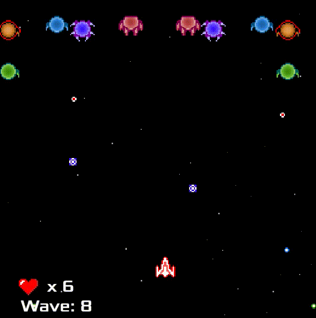

# super small shoot 'em up

assets are from <https://github.com/randomerz/small_shmup>

made with `ggez` and `specs`

Prebuilt binaries for Windows and Linux can be found in the [releases tab](https://github.com/mkhan45/ssshmup/releases)

## controls:

WASD or Arrow keys to move
Space to shoot
LControl to activate deflector for .1 seconds, deflected bullets heal player if they hit an enemy. There is a two second cooldown
